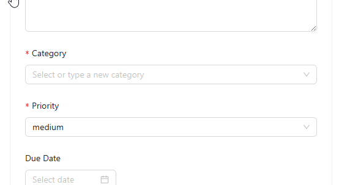

# Task Management Application

## Introduction

This is a task management application built using React. It allows users to create and delete tasks, as well as set deadlines and categories for tasks. In addition, it will remind users of tasks that are about to expire but have not been completed. All data is saved locally.

click [here](https://whimsical-mermaid-d24c76.netlify.app) to see the live demo.

Roadmap:

- [x] Filtering Tasks
- [x] Task Categories
- [x] Task Priority
- [x] Search
- [x] Drag and Drop
- [x] Due Dates
- [x] Responsive and Accessible Application
- [x] Animations or Visual Cues
- [x] Persist Task Data
- [ ] User Authentication

## Get started

### Create a task

To create a task, just simply type the task title in the input box and enter the description if you want. And select the category, priority and due date of task. After that, click the `Add Task` button. The task will be added to the list of tasks below.

### Add a new category

By default, the existing will list in the category dropdown. If you want to add a new category, just simply type the category name in the input box and press `enter`. The new category will be added to the category dropdown.

### Delete a task

To delete a task, click the `Delete` button on the right side of the task. The task will be removed from the list of tasks.

### Mark a task as completed

To mark a task as completed, click the check box on the left side of the task. The task will be marked as completed and will be moved to the completed task list.

### Sort tasks

You can sort tasks by priority, due date, and even custom. Just simply select the sorting option from the dropdown.

Remember, you can only drag and drop the tasks in the custom sorting option.

### Filter tasks

You can filter tasks by category and complete status. Just simply select the category or status from the dropdown.

### Search tasks

Too many tasks? You can search for a task by typing the task title in the search box. The tasks will be filtered based on the search keyword.

### Reminder

The application will remind you of tasks that are about to expire but have not been completed. The reminder will be shown at the top right of the page.

### Local storage

All data is saved locally. So, you can close the browser and reopen it, the data will still be there. Your data will never be sent to the server.

## How to run

If you want to run the application locally, follow these steps:

1. Clone the repository
2. Run `npm install` to install the dependencies
3. Run `npm start` to start the application

You can also visit the live demo [here](https://whimsical-mermaid-d24c76.netlify.app).
